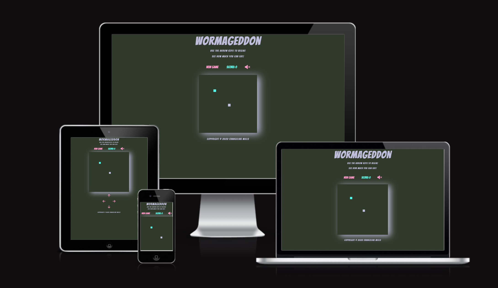
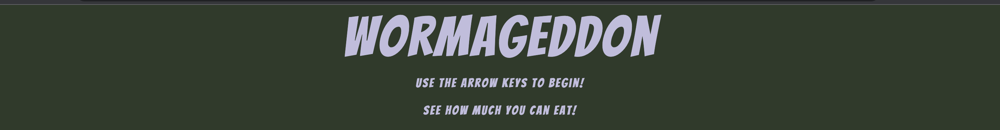
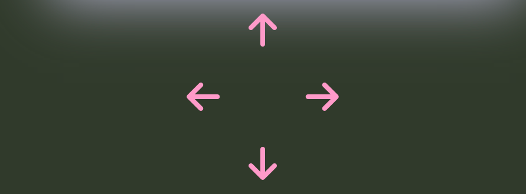
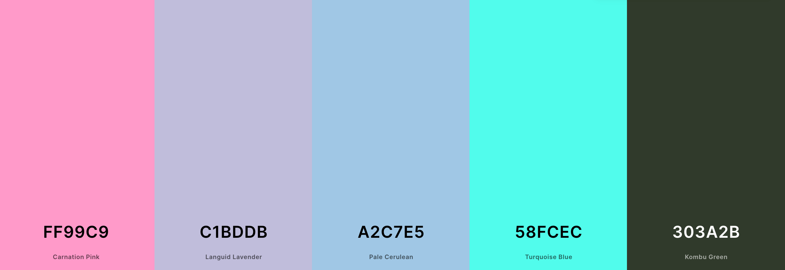
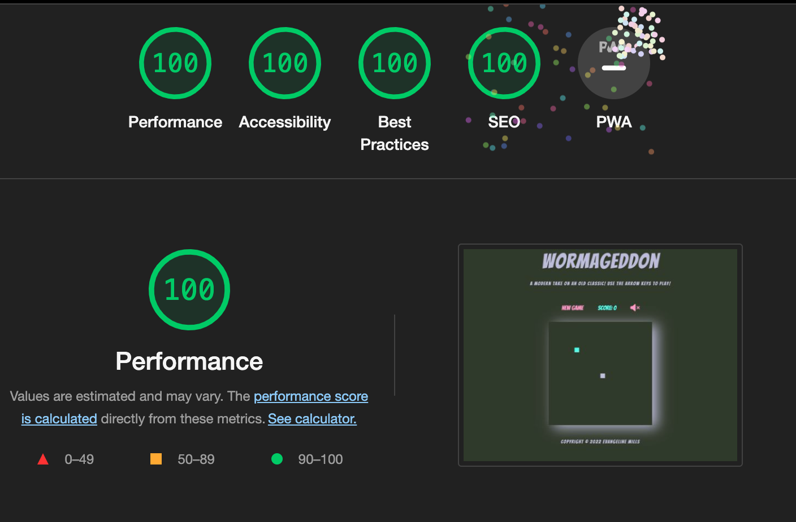

# WORMAGEDDON
# Portfolio Project 2 - JavaScript Essentials
----

WORMAGGEDON is a copy of the old fashioned Snake game we all know and love! It has been created for fun purposes only. It has been designed using the arcade theme but with fun colours. It provides a nostalgic accessible break from modern day life, that is easy, fun and enjoyable. Anybody can play this game whether on a computer or mobile phone!

----
[View the live project here.](https://evangelinemills.github.io/Portfolio-Project-2/)

----

## Features

#### Header
----
The logo is the name of the game. It is designed to be fun, quirky and enticing. Encouraging game users to take part. As it is a smiple game, the header provides brief instructions on how to begin the game and the aim of the game. 

#### Menu Bar
----
* New Game: The user is able to click this button to clear the current game or commence a 'New Game' when 'Game Over'.
* Score: The score will go up as the user plays the game - the user can view it here. 
* Sound: The sound plays in the background of the game - the user can toggle this on or off. It always commences in the off position. This gives users the option to play in silence. 

#### Game Area
----
The game area itself is the most important part of the screen. Its content is large and sits in the centre of the screen. It has a shadow effect to to make it appear raised off the screen. This section is where the game takes place. All other parts of the website are external to this section. 

#### Button Controls
----
The game can be played on any device. Where a keypad is available - the arrow keys are programmed for use. On a mobile the on-screen arrow button controls control the game. These buttons are hidden on larger screen sizes for simplicity. 

#### Footer
----
The footer is plain and contains a simple copyright message. This avoids distraction from the game and it didnt warrant any external site links to socials. 

## Design
----
* Typography: I used [Bangers](https://fonts.google.com/?query=bangers). It is a fun font for this game. It has a comic like script. 

* Colour Scheme: The colours were chosed to be edgy and fun. The Dark Green of the background allows the brighter colours to pop off the screen. They are accessible and easy to view colours. 

* Audio: The sound is optional depending on user preference. It is arcade game themed and provides a nostalgic edge to the game. 

## Technologies Used
----
* [HTML 5](https://en.wikipedia.org/wiki/HTML5)
* [CSS 3](https://en.wikipedia.org/wiki/CSS)
* [JavaScript ES6](https://www.w3schools.com/js/js_es6.asp)

### Frameworks, Libraries and Programes Used
----
* [Coolors]( https://coolors.co/ff99c9-c1bddb-a2c7e5-58fcec-303a2b)-The website "Coolors" was used as my color picking tool. They all contrast well and pass through the [Lighthouse](https://chrome.google.com/webstore/detail/lighthouse/blipmdconlkpinefehnmjammfjpmpbjk?hl=en) colour contrast checker.

* [Google Fonts](https://fonts.google.com/?query=bangers)-Google fonts was used to import Bangers into the CSS file. It is used throughout the whole project with Sans-serif as an accessible back up should the browser not support it. 

* [Font Awesome](https://fontawesome.com/)-This was used for the arrow button control icons. 

* [Gitpod](https://www.gitpod.io/?utm_source=googleads&utm_medium=search&utm_campaign=dynamic_search_ads&utm_id=16501579379&utm_content=dsa&gclid=EAIaIQobChMI8uT5kceg-gIVBuvtCh0bdwD3EAAYASAAEgIbZ_D_BwE)-This was used for the development of the website. It was used for the coding and used to commit and push to GitHub. 

* [GitHub](https://github.com/)-I used the Code Institutes initial project template from the repository. Then all of the code was commited and pushed to this cloud site. 

* [Chrome DevTools](https://developer.chrome.com/docs/devtools/)-Chrome is an inbuilt feature that was used to fix layout and other bugs byt logging elements to the console. 

* [Am I Responsive?](https://ui.dev/amiresponsive)-This website was used to to generate a a responsiveness mockup images used at the top of this README file. 

* [Favicon](https://favicon.io/emoji-favicons/worm/)-The worm logo for the browser tab was taken from here.

## Testing
----
* ### HTML
No errors were shown on the official [W3C](https://validator.w3.org/) validator.
* ### CSS
No errors were found on the official [W3C CSS](https://jigsaw.w3.org/css-validator/) validator.
* ### JavaScript
No errors were found when passed throught [JSHint](https://jshint.com/). 
* ### DevTools - Lighthouse
No errors were found when passed through [Lighthouse](https://chrome.google.com/webstore/detail/lighthouse/blipmdconlkpinefehnmjammfjpmpbjk?hl=en) for both Desktop and Mobile.

The game has been thoroughly tested by the creator. 
* The New Game button has been tested through use. It works if pressed in the middle of a game, or when 'Game Over'. It resets the screen, ready for the player to go again. 
* Score - Having played the game multiple time - I have ensured the score increments correctly x1 each time the snake eats the food. 
* Sound - The sound on/off toggle button works correctly. It always commences in the off position. The user has the choice to toggle it on or off. On 'Game Over' the music stops. 
* Canvas - the game itself is working and functional. This has been thoroughly tested by the creator and other members of the public. The snake length correctly increases when it eats food. I have checked that the game ends when the snake crashes into any of the four walls or its own body. 
* Sweet Alert - the sweet alert pops up when 'Game Over' and instructs the user to click the 'New Game' button to play again. The music correctly stops playing when the pop up appears. 
* Button Control - the game can be controlled by keypad arrows or the button grid which is displayed on smaller screens. All of these function correctly and the snake moves in the correct direction when clicked or pressed. 
* Responsiveness - the game works correctly on Google Chrome and Safari. It has been checked on DevTools multiple screen devices and functions correctly on the simulated devices. 

## Bugs
----
* - Problem: When writing the startRefresh function that conrtols the speed of the snake it broke the game.
  - Cause: I was able to locate eventually that I had not defined Play as variable but had used it in the function.
  - Resolution: I defined Play with my variables and the game worked. 

* - Problem: I inititally had the speed of the snake controlled in the drawGame function but when a 'New Game' was commenced the speed of the snake increased each time. 
  - Cause: The way i had the code writted meant that it was constantly running in the background, therefore every time a new game started it re wrote the code ontop of the existing code, thus increasing the speed by double every time.
  - Resolution: I re-wrote the speed of the snake in the startRefresh function using a Boolean. It now clears the game and restarts a whole new game every time the game is over. 

* - Problem: 'New Game' button wouldn't work as expected when I wrote the newGame event listener code.
  - Cause: I hadn't called the drawGame function at the end of the code.
  - Resolution: I added in the missing code and the button worked as expected.

## Deployment
----
 * The site was deployed to GitHub pages by the following steps;
   - In the GitHub repository navigate to settings.
   - Scroll down to pages, and from the source menu select Main. 
   - Once this has been selected a link was generated to the completed site. 

## Credits
----
### Content
----
A [tutorial](https://www.section.io/engineering-education/how-to-build-a-snake-game-with-javascript/) was followed to assist in the coding of this website. 

The code to assist the Game Over alert was adapted from [Sweet Alert](https://sweetalert2.github.io/#examples).

### Media
----
The background audio for the game was taken from [Pixabay]( https://pixabay.com/music/search/eating%20food/?order=None). 

# Acknowledgements
- Thank you to my mentor Richard Wells for the feedback and recommended tools.
- Thankyou to my family for the feedback and testing of the website.
- Thank you to my peers on Slack for help and inspiration. 

Please note that this website is solely for project purposes and is not intended for use. 

Evangeline Mills, 2022

